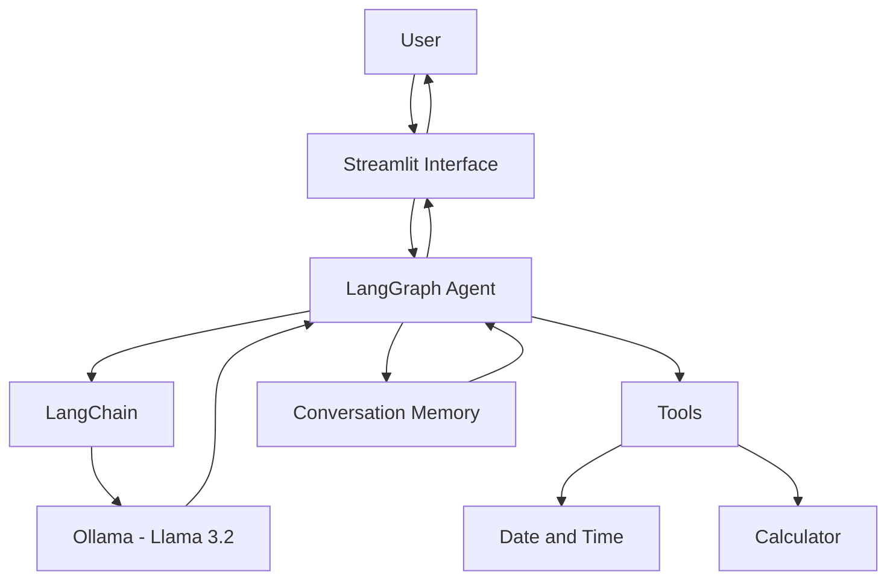

# Personal AI Assistant Architecture

```mermaid
flowchart TD
    A[User] --> B[Streamlit Interface]
    B --> C[LangGraph Agent]
    C --> D[LangChain]
    D --> E[Ollama - Llama 3.2]
    C --> F[Tools]
    F --> G[Date and Time]
    F --> H[Calculator]
    C --> I[Conversation Memory]
    I --> C
    E --> C
    C --> B
    B --> A
```
